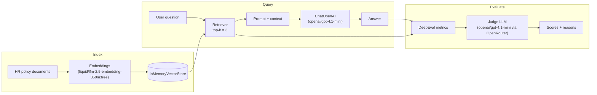

# RAG Evaluation with DeepEval


A small RAG pipeline — built to be evaluated, not just to answer questions. An in-memory vector store over a handful of HR policy documents feeds a `gpt-4.1-mini` chat model, and every answer is scored with [DeepEval](https://deepeval.com/)'s RAG metric suite (Answer Relevancy, Faithfulness, Contextual Relevancy, Contextual Precision, Contextual Recall). Both the RAG pipeline and the judge model run through [OpenRouter](https://openrouter.ai/) so you don't need a paid OpenAI key.

## How it works



Both the chat model and the judge model are routed to OpenRouter's OpenAI-compatible endpoint (`https://openrouter.ai/api/v1`), and embeddings use a free OpenRouter embedding model — so the whole notebook runs on a single `OPENROUTER_API_KEY`.

## Results

Running the six-question HR-policy dataset through the pipeline and scoring it with DeepEval produces a per-test-case breakdown plus an aggregate summary:

<p align="center">
  
  <br>
  <em><strong>test_case_0</strong> — "How many paid leaves does a full-time employee receive?" Answer Relevancy, Faithfulness, Contextual Precision, and Contextual Recall all pass; Contextual Relevancy fails (0.33) because the retrieved chunks include unrelated remote-work and reimbursement policies alongside the correct one.</em>
</p>

<p align="center">
  
  <br>
  <em><strong>test_case_1 & test_case_2</strong> — work-from-home and internet reimbursement questions. Same pattern: the answer is fully correct and faithful to the source, but Contextual Relevancy fails because the top-3 retrieval pulls in adjacent, off-topic policy chunks.</em>
</p>

<p align="center">
  
  <br>
  <em><strong>test_case_3 & test_case_4</strong> — probation period and remote-work-frequency questions. test_case_4 is the one case where Answer Relevancy also fails (0.00): the judge flags the "No, ..." phrasing as not directly addressing the 3-day framing of the question, even though the underlying fact is correct.</em>
</p>

<p align="center">
  
  <br>
  <em><strong>test_case_5</strong> — medical insurance start date, plus the <strong>aggregate metrics table</strong> across all 6 test cases: Faithfulness, Contextual Precision, and Contextual Recall all hit 100%, Answer Relevancy hits 83% (5/6), and Contextual Relevancy hits 0% (0/6) — the retriever's top-3 window is the consistent weak point.</em>
</p>

| Metric | Avg. Score | Pass Rate |
|---|---|---|
| Answer Relevancy | 0.83 | 83% (5/6) |
| Faithfulness | 1.00 | 100% (6/6) |
| Contextual Relevancy | 0.33 | 0% (0/6) |
| Contextual Precision | 1.00 | 100% (6/6) |
| Contextual Recall | 1.00 | 100% (6/6) |

Contextual Relevancy fails consistently at `k=3` retrieval — the correct chunk is always retrieved (precision/recall are perfect), but the extra two neighboring chunks dilute relevancy below the 0.75 threshold. Lowering `k` or tightening the retriever would fix that; it's left as-is here to show the metric doing its job.

## Requirements

- **Python 3.12**
- [**uv**](https://docs.astral.sh/uv/) — package & environment manager
- An [OpenRouter](https://openrouter.ai/settings/keys) API key

### Installing uv

```bash
# Windows (PowerShell)
powershell -c "irm https://astral.sh/uv/install.ps1 | iex"

# macOS / Linux
curl -LsSf https://astral.sh/uv/install.sh | sh
```

## Setup

### 1. Check the Python versions available

```bash
uv python list
```

If 3.12 isn't listed, install it:

```bash
uv python install 3.12
```

### 2. Create the virtual environment

```bash
uv venv .venv --python 3.12
```

### 3. Activate it

```bash
.venv\Scripts\activate       # Windows (PowerShell / CMD)
source .venv/bin/activate    # macOS / Linux
```

### 4. Install the dependencies

```bash
uv pip install -r requirements.txt
```

### 5. Set your OpenRouter key

The first code cell in the notebook prompts for `OPENROUTER_API_KEY` if it isn't already set as an environment variable — no `.env` file required, though you can put it there if you prefer.

## Usage

Open `Evaluation.ipynb` in VS Code (or Jupyter) and run the cells top to bottom:

1. **Index** — embeds the sample HR documents into an in-memory vector store.
2. **RAG pipeline** — retrieves top-3 chunks and answers each question with the chat model.
3. **Evaluate** — scores every answer with DeepEval's RAG metrics and prints the results table shown above.

Select the `.venv` interpreter as the notebook kernel before running.

## Managing dependencies

```bash
uv pip install <package>              # add a package
uv pip freeze > requirements.txt      # lock the current environment
uv pip list                           # show what's installed
```

## Project structure

```
Evaluation/
├── .venv/                          # virtual environment (git-ignored)
├── .deepeval/                      # DeepEval's local cache/config (git-ignored)
├── images/                         # evaluation result screenshots
├── Evaluation.ipynb                # the RAG + DeepEval notebook
├── evaluation-handwritten-notes.pdf
├── requirements.txt                # Python dependencies
├── .env                            # local secrets (git-ignored)
├── .gitignore
└── README.md
```

## Known issues

- **Windows caching lock errors**: DeepEval's test-run cache needs `pywin32` for shared file locks on Windows. `requirements.txt` pulls in `portalocker[win32]` on Windows to cover this — if you see `AttributeError: 'NoneType' object has no attribute 'test_cases_lookup_map'`, reinstall dependencies and restart the kernel.
- **OpenRouter 402 credit errors**: OpenRouter reserves credits based on the *maximum possible* completion length before a call succeeds. Both `ChatOpenAI` and the DeepEval judge model in the notebook explicitly cap `max_tokens` to avoid over-reserving against a free/low balance.

## License

TBD
